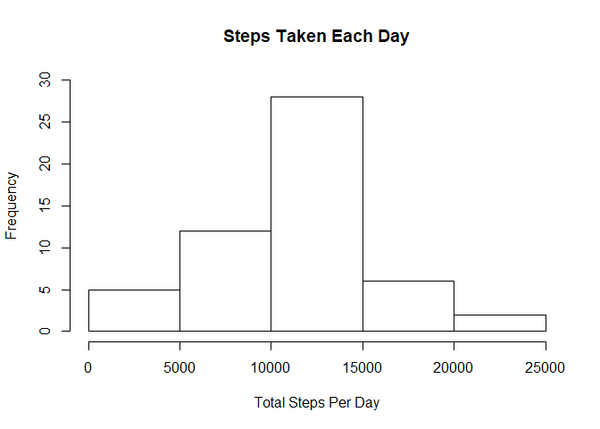
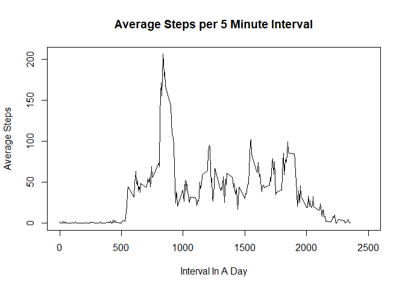
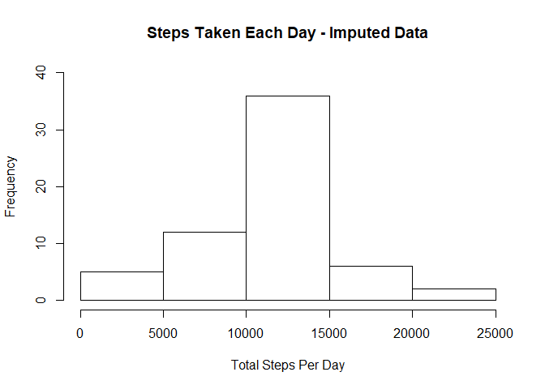
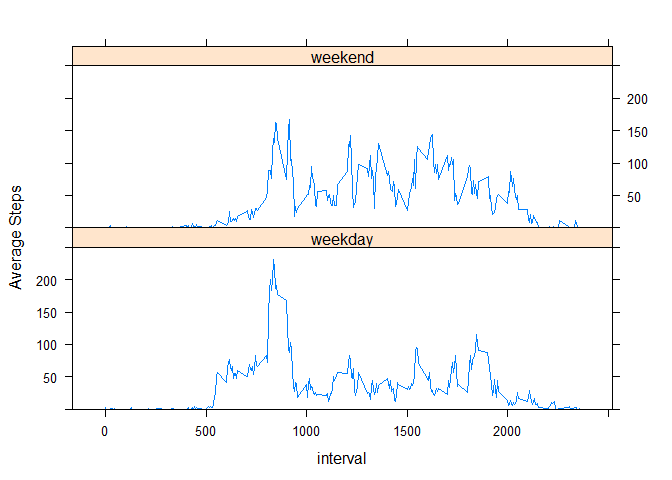

## Load Activity Data
Load the activity data using 'read.csv' function. This function assumes that the file to be read is available in the working directory setup for your session.


```r
  activityData <- read.csv("activity.csv")
```

## Assignment Part 1 Results

We'll use 'aggregate' function to calculate total number of steps taken per day.


```r
  dailySteps <- aggregate(x=activityData$steps, by=list(dateofmeasurement = activityData$date), FUN = sum)
```

### Total Number of Steps Taken per day

We'll use the 'hist' function to make a histogram of total number of steps taken each day.

```r
  hist(dailySteps$x, main = "Steps Taken Each Day", xlab = "Total Steps Per Day", ylim = c(0,30))
```

<!-- -->

### Mean and Median of total number of steps taken per day

We'll use the *mean* and *median* functions to calculate the mean and median values for steps taken per day. We have used *round* and *format* functions to format the output for mean so that it can be embedded in the result statement.


```r
  dailyMean <- format(round(mean(dailySteps$x, na.rm = TRUE),2), nsmall = 2)
  dailyMedian <- median(dailySteps$x, na.rm = TRUE)
```

The **mean** of total number of steps taken per day is *10766.19* and the **median** of total number of steps taken per day is *10765*.

### Average Daily Activity pattern

We'll first calculate the average (*mean*) steps taken per 5-minute interval and store the result in avgSteps. We'll use avgSteps to create a time series plot.


```r
  avgSteps <- aggregate(x=activityData$steps, by=list(interval = activityData$interval), FUN = function(stepsvalue){y = stepsvalue; return(format(round(mean(y, na.rm = TRUE),2),nsmall = 2))})
```

Now we'll make a Time Series plot.


```r
  plot(avgSteps, type="l", xlim=c(0,2500), main = "Average Steps per 5 Minute Interval", xlab = "Interval In A Day", ylab = "Average Steps")
```

<!-- -->

Now, we'll determine the interval which contains maximum number of steps.


```r
  maxStepInterval <- avgSteps[which(avgSteps$x == max(as.numeric(avgSteps$x))),]
```

The 5-minute interval which, on average across all the days in the dataset, contains the maximum number of steps is **835**.

## Assignment Part 2 - Imputing missing values - Results

Now, we'll calculate the total number of missing values in the original data set *activityData*.


```r
  totalMissingVals <- sum(is.na(activityData))
```

Total number of missing values in the entire original dataset *activityData* is **2304**. The missing values are for variable *steps*.

We'll fill in the missing values of the steps using the mean for that 5 minute interval across days where the values were originally provided.


```r
  activityDataImputed <- data.frame(activityData %>% group_by(interval) %>% mutate(steps = ifelse(is.na(steps), as.numeric(avgSteps[avgSteps$interval == interval,]$x), steps)))
```

We'll use 'aggregate' function to calculate total number of steps taken per day With Imputed values for NAs.


```r
  dailyStepsImputed <- aggregate(x=activityDataImputed$steps, by=list(dateofmeasurement = activityDataImputed$date), FUN = sum)
```


### Total Number of Steps Taken per day - With Imputed values for NA

We'll use the 'hist' function to make a histogram of total number of steps taken each day using new data with imputed values for NAs.

```r
  hist(dailyStepsImputed$x, main = "Steps Taken Each Day - Imputed Data", xlab = "Total Steps Per Day", ylim = c(0,40))
```

<!-- -->

### Mean and Median of total number of steps taken per day - Imputed Data

We'll use the *mean* and *median* functions to calculate the mean and median values for steps taken per day. We have used *round* and *format* functions to format the output for mean so that it can be embedded in the result statement.


```r
  dailyMeanImp <- format(round(mean(dailyStepsImputed$x, na.rm = TRUE),2), nsmall = 2)
  dailyMedianImp <- format(round(median(dailyStepsImputed$x, na.rm = TRUE),2), nsmall = 2)
```

The **mean** of total number of steps taken per day (for Imputed data set) is *10766.18* and the **median** of total number of steps taken per day (for Imputed data set) is *10766.13*.

Comparing the *mean* and *median* post imputing the data with *mean* and *median* derived from the base data shows a slight difference in both the values.

## Activity Pattern comparison between Weekday and Weekends

We'll now use *weekdays* function to determine if the date in the data set falls on a weekday or weekend and we'll user *mutate* function to add a new variable to record the *day* value.


```r
  activityDataImputed <- data.frame(activityDataImputed %>% group_by(date) %>% mutate(daytype = ifelse(weekdays(as.Date(date)) == "Saturday", "weekend", ifelse(weekdays(as.Date(date)) == "Sunday", "weekend", "weekday"))))
```

We'll now calculate average steps in 5-minute interval for *weekday* days and *weekend* days.


```r
  avgStepsImputed <- aggregate(x=activityDataImputed$steps, by=list(interval = activityDataImputed$interval, daytype = activityDataImputed$daytype), FUN = function(stepsvalueImp){y = stepsvalueImp; return(format(round(mean(y, na.rm = TRUE),2),nsmall = 2))})
```

We'll now make a panel plot containing a time series plot of 5-minute interval (x-axis) and the average number of steps taken, averaged across all weekday days or weekend days (y-axis).


```r
  xyplot(x ~ interval | daytype, data=avgStepsImputed, layout = c(1,2), type = "l", ylim = c(0,250), ylab = "Average Steps")
```

<!-- -->
